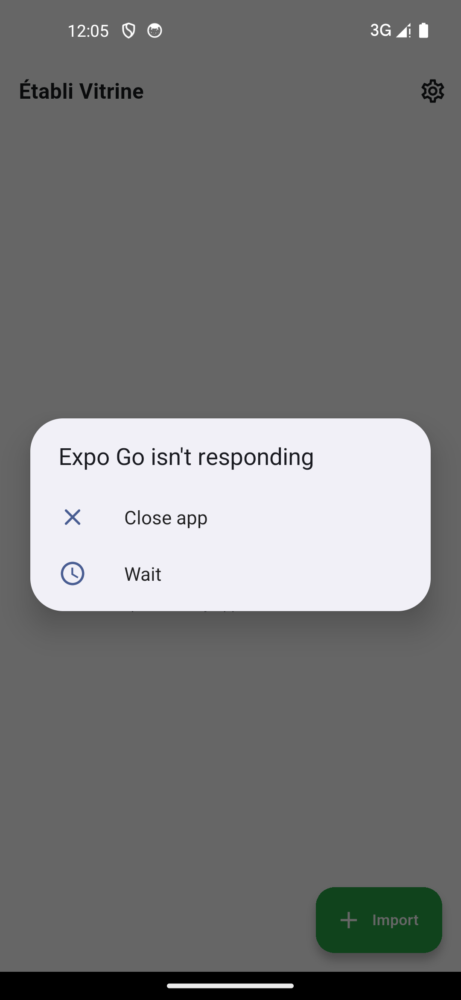

Vitrine est la vitrine des applis Shiny qui doivent fonctionner sans serveur. Un runtime WebR embarqué exécute l'appli en local ; une WebView affiche l'UI.

{width=320}

## Modules

| Zone | Fonction |
|------|----------|
| **Bibliothèque**     | Liste des applis importées avec nom, source d'import et statut. |
| **Importateur**      | Quatre sources : sélecteur de fichiers, URL, feuille de partage, source brute. |
| **Runner**           | Lance l'appli sélectionnée dans une WebView locale contre le runtime WebR embarqué. |
| **Vue détail**       | Métadonnées, chemin, date d'import ; suppression ou réimport. |

## Flux d'import

| Source | Forme attendue |
|--------|----------------|
| Bundle shinylive (`.zip`) | contient un `app.json` au format shinylive et tourne tel quel. |
| Bundle source brute (`.zip` ou dossier) | `app.R` *ou* `ui.R` + `server.R` ; Vitrine l'emballe en interne au format shinylive. |
| Source brute (snippet) | code R collé — Vitrine construit un `app.json` depuis un `app.R` virtuel. |

## Runtime

| Composant | Rôle |
|-----------|------|
| **WebR**          | Runtime R en WebAssembly (R 4.6). |
| **shinylive**     | Runtime Shiny, exécutable dans un navigateur/WebView. |
| **Serveur HTTP local** | Sert les fichiers d'assets avec les en-têtes COOP/COEP nécessaires à WebR pour activer `SharedArrayBuffer`. Bascule sur PostMessage sinon. |

## Exemples

| App | Objet |
|-----|-------|
| **Sample (shinylive)** | Démo intégrée : histogramme + curseur, montre le runner sans configuration. |
| **Raw R sample** | Exemple intégré pour le flux d'import en source brute. |
| **Analyse de puissance statistique** | Livrée comme appli Shiny dans Vitrine — pas de téléchargement d'appli supplémentaire. |

## Garantie hors ligne

Les applis tournent entièrement dans le bac à sable WebAssembly local. La seule requête sortante intervient lors d'un import explicite depuis une URL.

## Distribution

| Canal | App |
|-------|-----|
| App Store (iOS) · Google Play (Android) | Vitrine |
| F-Droid — dépôt propre à Etabli | Vitrine (embarque des runtimes WASM précompilés) |
| Code source | [`etabli-dev/etabli-vitrine`](https://github.com/etabli-dev/etabli-vitrine) |
