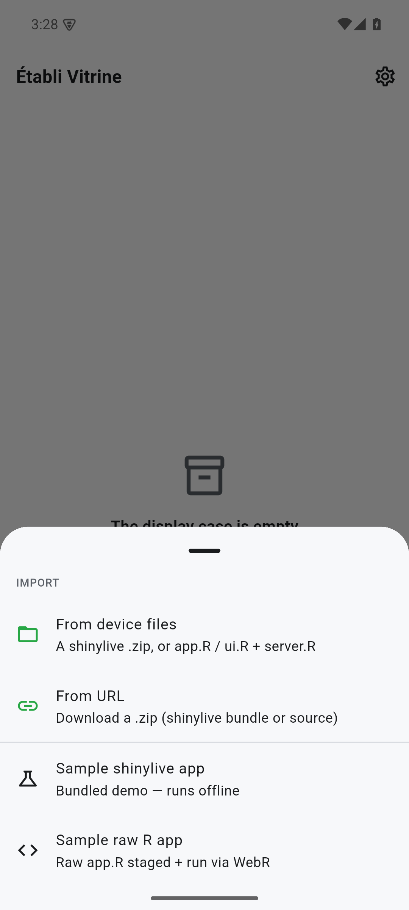
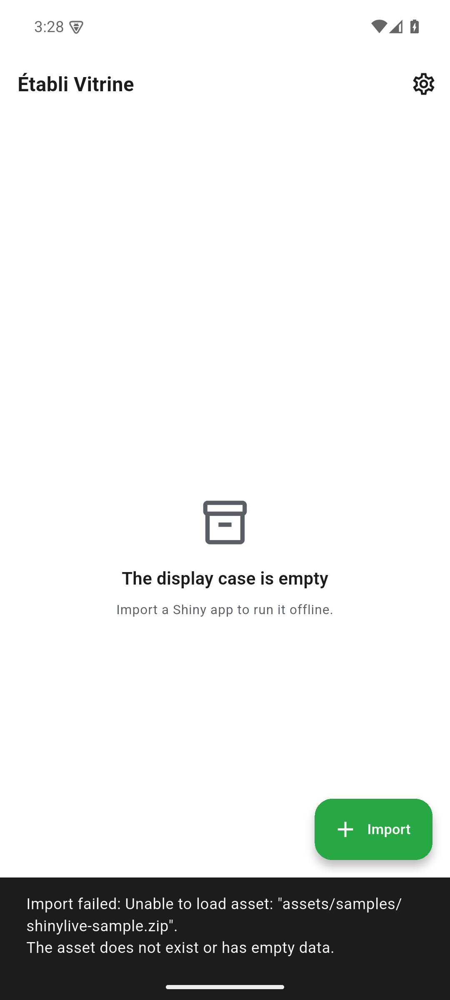

Une visite guidée, capture par capture, d'Établi Vitrine v0.1.0 — la vitrine qui
exécute des applications Shiny hors ligne via shinylive + WebR. Chaque figure est
une vraie capture d'écran de la version v0.1.0 sur un appareil Android.

## La vitrine

La vitrine liste les applications Shiny que vous avez importées, chacune
exécutable hors ligne d'une seule touche. À l'installation, elle est vide et
invite à **+ Importer**.

{width=320}

## Importer une application Shiny

**+ Importer** ouvre une feuille avec quatre sources : **Depuis les fichiers de
l'appareil** (un `.zip` shinylive, ou `app.R` / `ui.R` + `server.R`), **Depuis une
URL** (télécharger un `.zip`), et deux **exemples intégrés** — *Sample shinylive
app* et *Sample raw R app*.

{width=320}

## Exemples intégrés — note v0.1.0

La feuille d'import propose les exemples intégrés, mais en v0.1.0 le fichier de
l'exemple est absent ; l'import échoue donc **proprement** (sans plantage) avec
« Unable to load asset … does not exist or has empty data ». Une vraie application
Shiny s'exécute néanmoins très bien si on l'importe depuis les fichiers ou une URL.

{width=320}

## Réglages

Les réglages couvrent le thème (clair / sombre / système) et les préférences
d'exécution.

{width=320}

## Exécution

| Composant | Rôle |
|-----------|------|
| **WebR** | runtime R en WebAssembly. |
| **shinylive** | runtime Shiny, exécutable dans une WebView. |
| **Serveur HTTP local** | sert les fichiers avec les en-têtes COOP/COEP requis par WebR. |

## Garantie hors ligne

Les applications s'exécutent entièrement dans le bac à sable WebAssembly local. La
seule requête sortante a lieu si vous importez délibérément une appli depuis une URL.

## Où l'obtenir

Android uniquement pour l'instant — une **version de développement (APK signé)**
via [GitHub Releases](https://github.com/etabli-dev/etabli-vitrine/releases/tag/v0.1.0).
App Store, Google Play et F-Droid sont prévus mais pas encore disponibles.
