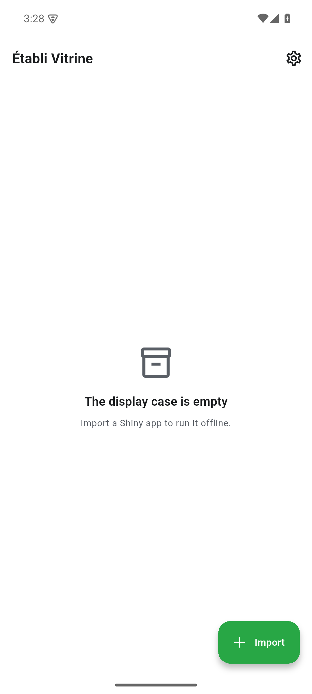

Application phare

> Exécuter des applications Shiny interactives, entièrement sur l'appareil.

Établi Vitrine embarque WebR et shinylive-R et exécute des applications Shiny interactives en local — sans serveur, sans réseau. Les applis peuvent être importées depuis la bibliothèque, le système de fichiers, la feuille de partage ou une URL. L'analyse de puissance statistique est livrée comme une appli Shiny intégrée à Vitrine ; il n'y a plus d'application autonome dédiée à la puissance.

{width=320}

## À qui ça s'adresse

Aux auteurs d'applis Shiny qui veulent les démontrer sans monter de serveur — en conférence, en cours, à des collègues sans installation R. Et à toute personne ayant besoin d'outils statistiques (p. ex. calcul de puissance) mobile et hors ligne.

## Plateformes

| Plateforme | Statut |
|------------|--------|
| iOS        | ✓      |
| Android    | ✓      |
| macOS      | ✓      |
| Linux      | ✓      |
| Windows    | ✓      |

## Vie privée

Aucun outil d'analyse, aucun SDK tiers. L'appli fonctionne entièrement hors ligne ; les applis Shiny importées s'exécutent dans un bac à sable WebAssembly local. Rien ne quitte l'appareil.

## Installation

Établi Vitrine est **en cours de développement actif**. Il n'existe pas encore de version App Store, Google Play ou F-Droid.

| Canal | Statut |
|-------|--------|
| Android (APK) | **Version de développement** via [GitHub Releases](https://github.com/etabli-dev/etabli-vitrine/releases) |
| App Store (iOS) | prévu — pas encore disponible |
| Google Play | prévu — pas encore disponible |
| F-Droid | prévu — pas encore disponible |
| Desktop (macOS, Windows, Linux) | build depuis les sources |

Détails : voir [Premiers pas](getting-started.qmd).

## Soutenir

Si l'appli vous est utile : [Liberapay](https://liberapay.com/rabanheller/) · dans l'appli même vous trouverez également un lien Buy-Me-a-Coffee.
